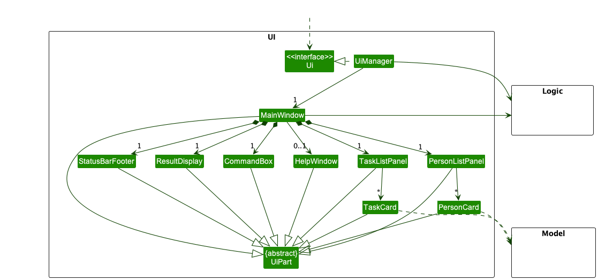
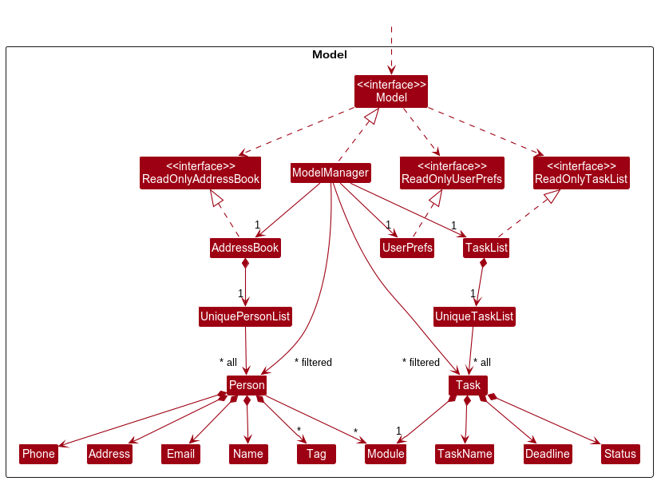
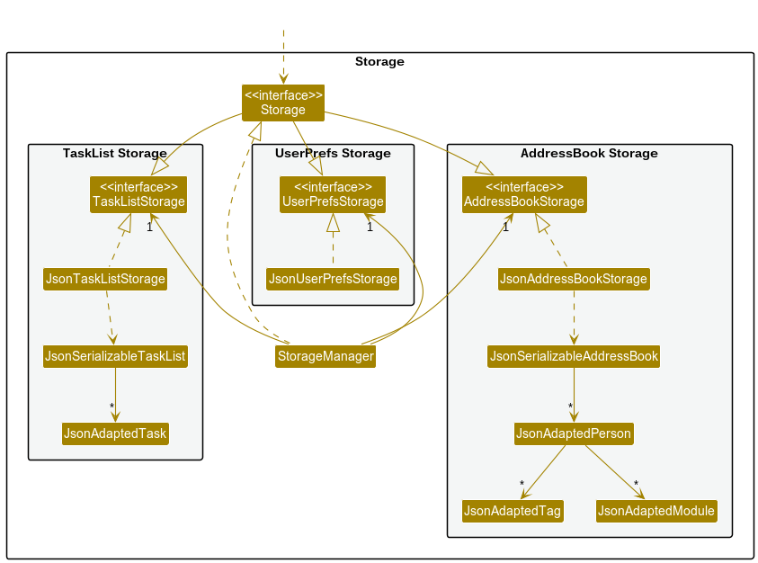
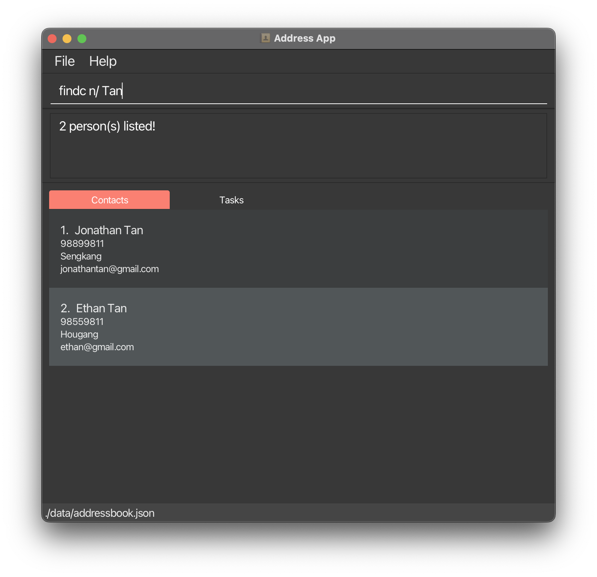
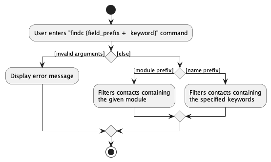
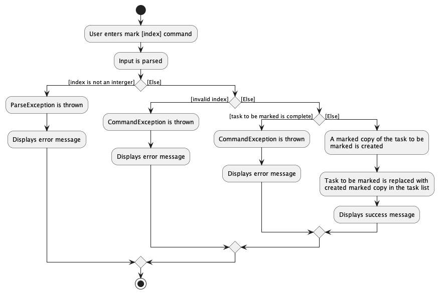
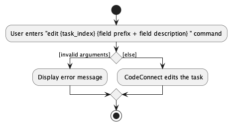

* Table of Contents
{:toc}

--------------------------------------------------------------------------------------------------------------------

## Introduction

CodeConnect is a **desktop app** specially designed for **Computer Science students from NUS**. With this app, not only can you manage your **tasks and contacts** effectively in one unified place, you can also conveniently search for peers to seek help or collaboration on a particular task.

This developer guide serves both as a **guide for new contributors** to navigate and start working on the project and as a reference to various code and feature **design decisions** for existing developers.

--------------------------------------------------------------------------------------------------------------------

## Acknowledgements

We use the following libraries in CodeConnect:

* [JChronic](https://mvnrepository.com/artifact/com.rubiconproject.oss/jchronic)

--------------------------------------------------------------------------------------------------------------------

## Setting up, getting started

Refer to the guide [_Setting up and getting started_](SettingUp.md).

--------------------------------------------------------------------------------------------------------------------

## Design

:bulb: **Tip:** The `.puml` files used to create diagrams in this document can be found in the [diagrams](https://github.com/se-edu/addressbook-level3/tree/master/docs/diagrams/) folder. Refer to the [_PlantUML Tutorial_ at se-edu/guides](https://se-education.org/guides/tutorials/plantUml.html) to learn how to create and edit diagrams.

### Architecture

The ***Architecture Diagram*** given above explains the high-level design of the App.

Given below is a quick overview of main components and how they interact with each other.

**Main components of the architecture**

**`Main`** has two classes called [`Main`](https://github.com/se-edu/addressbook-level3/tree/master/src/main/java/seedu/address/Main.java) and [`MainApp`](https://github.com/se-edu/addressbook-level3/tree/master/src/main/java/seedu/address/MainApp.java). It is responsible for,
* At app launch: Initializes the components in the correct sequence, and connects them up with each other.
* At shut down: Shuts down the components and invokes cleanup methods where necessary.

[**`Commons`**](#common-classes) represents a collection of classes used by multiple other components.

The rest of the App consists of four components.

* [**`UI`**](#ui-component): The UI of the App.
* [**`Logic`**](#logic-component): The command executor.
* [**`Model`**](#model-component): Holds the data of the App in memory.
* [**`Storage`**](#storage-component): Reads data from, and writes data to, the hard disk.

**How the architecture components interact with each other**

The *Sequence Diagram* below shows how the components interact with each other for the scenario where the user issues the command `delete 1`.

Each of the four main components (also shown in the diagram above),

* defines its *API* in an `interface` with the same name as the Component.
* implements its functionality using a concrete `{Component Name}Manager` class (which follows the corresponding API `interface` mentioned in the previous point.

For example, the `Logic` component defines its API in the `Logic.java` interface and implements its functionality using the `LogicManager.java` class which follows the `Logic` interface. Other components interact with a given component through its interface rather than the concrete class (reason: to prevent outside component's being coupled to the implementation of a component), as illustrated in the (partial) class diagram below.

The sections below give more details of each component.

### UI component

The **API** of this component is specified in [`Ui.java`](https://github.com/se-edu/addressbook-level3/tree/master/src/main/java/seedu/address/ui/Ui.java)

The UI consists of a `MainWindow` that is made up of parts e.g.`CommandBox`, `ResultDisplay`, `PersonListPanel`, `TaskListPanel`, `StatusBarFooter` etc. All these, including the `MainWindow`, inherit from the abstract `UiPart` class which captures the commonalities between classes that represent parts of the visible GUI.

The `UI` component uses the JavaFx UI framework. The layout of these UI parts are defined in matching `.fxml` files that are in the `src/main/resources/view` folder. For example, the layout of the [`MainWindow`](https://github.com/se-edu/addressbook-level3/tree/master/src/main/java/seedu/address/ui/MainWindow.java) is specified in [`MainWindow.fxml`](https://github.com/se-edu/addressbook-level3/tree/master/src/main/resources/view/MainWindow.fxml)

The `UI` component,

* executes user commands using the `Logic` component.
* listens for changes to `Model` data so that the UI can be updated with the modified data.
* keeps a reference to the `Logic` component, because the `UI` relies on the `Logic` to execute commands.
* depends on some classes in the `Model` component, as it displays `Person` object residing in the `Model`.

### Logic component

**API** : [`Logic.java`](https://github.com/se-edu/addressbook-level3/tree/master/src/main/java/seedu/address/logic/Logic.java)

Here's a (partial) class diagram of the `Logic` component:

How the `Logic` component works:
1. When `Logic` is called upon to execute a command, it uses the `CodeConnectParser` class to parse the user command.
1. This results in a `Command` object (more precisely, an object of one of its subclasses e.g., `AddCommand`) which is executed by the `LogicManager`.
1. The command can communicate with the `Model` when it is executed (e.g. to add a person).
1. The result of the command execution is encapsulated as a `CommandResult` object which is returned back from `Logic`.

The Sequence Diagram below illustrates the interactions within the `Logic` component for the `execute("delete 1")` API call.

:information_source: **Note:** The lifeline for `DeleteCommandParser` should end at the destroy marker (X) but due to a limitation of PlantUML, the lifeline reaches the end of diagram.

Here are the other classes in `Logic` (omitted from the class diagram above) that are used for parsing a user command:

How the parsing works:
* When called upon to parse a user command, the `CodeConnectParser` class creates an `XYZCommandParser` (`XYZ` is a placeholder for the specific command name e.g., `AddCommandParser`) which uses the other classes shown above to parse the user command and create a `XYZCommand` object (e.g., `AddCommand`) which the `CodeConnectParser` returns back as a `Command` object.
* All `XYZCommandParser` classes (e.g., `AddCommandParser`, `DeleteCommandParser`, ...) inherit from the `Parser` interface so that they can be treated similarly where possible e.g, during testing.

### Model component
**API** : [`Model.java`](https://github.com/se-edu/addressbook-level3/tree/master/src/main/java/seedu/address/model/Model.java)

The `Model` component,

* stores the address book data i.e., all `Person` objects (which are contained in a `UniquePersonList` object).
* stores the currently 'selected' `Person` objects (e.g., results of a search query) as a separate _filtered_ list which is exposed to outsiders as an unmodifiable `ObservableList<Person>` that can be 'observed' e.g. the UI can be bound to this list so that the UI automatically updates when the data in the list change.
* similarly stores the task data (all `Task` objects, contained in a `UniqueTaskList` object) and the 'selected' `Task` objects as a filtered list exposed as an unmodifiable `ObservableList<Task>`.
* stores a `UserPref` object that represents the user’s preferences. This is exposed to the outside as a `ReadOnlyUserPref` objects.
* does not depend on any of the other three components (as the `Model` represents data entities of the domain, they should make sense on their own without depending on other components)

:information_source: **Note:** An alternative (arguably, a more OOP) model is given below. It has a `Tag` list in the `AddressBook`, which `Person` references. This allows `AddressBook` to only require one `Tag` object per unique tag, instead of each `Person` needing their own `Tag` objects. 

### Storage component

**API** : [`Storage.java`](https://github.com/se-edu/addressbook-level3/tree/master/src/main/java/seedu/address/storage/Storage.java)

The `Storage` component,
* can save address book data, task list data  and user preference data in json format, and read them back into corresponding objects.
* inherits from `AddressBookStorage`, `TaskListStorage` and `UserPrefStorage`, which means it can be treated as any one (if only the functionality of only one is needed).
* depends on some classes in the `Model` component (because the `Storage` component's job is to save/retrieve objects that belong to the `Model`)

### Common classes

Classes used by multiple components are in the `seedu.addressbook.commons` package.

--------------------------------------------------------------------------------------------------------------------

## Implementation

This section describes some noteworthy details on how certain features are implemented.

### Finding Feature

#### About

CodeConnect has features that allow you to search for tasks and contacts. The finding features use the following commands:

* `find n/` —  Finds tasks in the TaskList by their description(name)
* `find m/` —  Finds tasks in the TaskList by their module
* `findc n/` —  Finds contacts in the AddressBook by their name
* `findc m/` —  Finds contacts in the AddressBook by their module

Examples of command use:
- `find n/ quiz` - Find all tasks containing the word "quiz"
- `find m/ CS1101S` - Find all tasks belonging to CS1101S
- `findc n/ Tan` - Find all contacts with names containing "Tan"
- `findc m/ CS1101S` - Find all contacts taking CS1101S

#### Implementation Flow

Outline of how components work together when the user enters a find command:
1. User enters `findc m/ CS1101S` into the command prompt box
2. User input `m/ CS1101S` is sent to the `FindContactCommandParser`
3. `FindContactCommandParser` determines the user's input to be valid
4. `FindContactCommandParser` creates a `ModuleTakenPredicate`
   - This `Predicate` is used by the `Model` to filter for contacts that take the queried module
5. A `FindContactCommand` command created and executed by the `Model`
6. The result of the find command is displayed to the user

Activity diagram of findc command execution

Sequence diagram of find command execution

Note: The implementation flow and the activity and sequence diagrams are similar for both the find and findc commands

#### Design Considerations

One design consideration was if the user should be allowed to find contacts matching more than one module. For example, the input `findc m/ CS1101S MA1521` will return all contacts taking CS1101S, MA1521, or both. The reason why we decided to use additive search condition is as follows:

Consider the following situation:
- You have two assignments due tomorrow, from two different modules: MOD_X and MOD_Y.
- Feeling stuck, you decide to use CodeConnect to search for help, to see if there's anybody you might have forgot.
- You enter the command `findc m/ MOD_X MOD_Y`

As a user in this situation, the last thing you would want is for the app to _exclude_ contacts taking both MOD_X and MOD_Y. Those would be the first people you want to ask for help!

Another design consideration was to make both the find commands for task and contacts easy to use and remember. For example, both `find` and `findc` uses the `n/` and `m/` prefixes, when searching by names and modules respectively.

This was done so that it would be easy for the user to remember what command to use when finding either contacts or tasks.
- The only difference when finding contacts is that there is a c after the find for contacts
- Both use the same prefixes

### Add task feature

#### About

CodeConnect has features that allow you to add and track your tasks and annotate them with modules, so that you can search for matching people. The `add` command, implemented in [`AddTaskCommand`](https://github.com/AY2223S1-CS2103T-T14-2/tp/blob/master/src/main/java/seedu/address/logic/commands/AddTaskCommand.java) and [`AddTaskCommandParser`](https://github.com/AY2223S1-CS2103T-T14-2/tp/blob/master/src/main/java/seedu/address/logic/parser/AddTaskCommandParser.java), is how you add new tasks.

Examples of command use:
- `add Lab2 by/2022-02-02 23:59 m/CS2030S`
- `add Add error handling by/next thursday m/CS2103T`

#### Implementation flow

The `add` command follows the [general command implementation flow](#logic-component). The `AddTaskCommandParser` uses `NaturalDateParser`, a thin wrapper over [`JChronic`](https://github.com/samtingleff/jchronic0), to parse the given deadline.

Sequence diagram of add command execution

#### Design Considerations

* A natural date parser is used because it gives the most flexibility possible in the type of date formats that can be entered, including relative dates ("tomorrow") and abbreviations ("2 Jan").
* When a date range is specified, the end of the range is used; e.g. a task that's due "tomorrow" will be due 23:59 tomorrow. This is the most common interpretation in our experience.
* `Deadline`, as a thin data class, only provides constructors from preparsed LocalDateTimes and its own serialization. Parsing user input is handled by other methods, such as `ParserUtil.parseDeadline`. This improves cohesion of the class.
* The `add` command shares the `m/` prefix for modules with the other commands.
  * The `by/` prefix is chosen for the deadline, as it is a good compromise between brevity and comprehensibility ("do this *by* a certain date").

### Marking and unmarking of tasks

#### About

CodeConnect has features that allow you to mark and unmark your tasks as complete and incomplete respectively.

Examples of command use:
* `mark 1`: marks the task at index 1 as complete
* `unmark 1`: unmarks the task at index 1 as incomplete

#### Implementation flow
Both the `mark` and `unmark` commands follow [general command implementation flow](#logic-component).

 
Activity diagram of mark command execution

Sequence diagram of unmark command execution

#### Design considerations

* One design consideration involoved marking/unmarking multiple tasks by adding a space before inputting the index of another task.
However, users could forget to input spaces when inputting indexes of multiple tasks, leading to unintended tasks being
marked/unmarked. This was considered to be an acceptable trade-off as users would be completing tasks one at a time
most of the time, so a mass mark/unmark feature is a nice-to-have one.

### Edit task feature

#### About

CodeConnect allows the user to edit an existing task in the task list.

Example of command use:
- `edit 1 m/CS1101S`

#### Proposed Implementation flow

Outline of how components work together when the user enters a `edit` task command:
1. The user input will be sent to `CodeConnectParser`
2. `CodeConnectParser` will take note of the command word and argument of the user input and create a `EditTaskComanndParser` instance.
3. The `EditTaskCommandParser` will call its `parse` method to get the index and create a `EditTaskDescriptor` instance that stores the edited field
4. A new `EditTaskCommand` will then be created with the parsed index and `EditTaskDescriptor` object
5. That `EditTaskCommand` object will execute and a new `Task` will be created with the new fields
6. The `model` will then be updated accordingly with the new Edited Task.

#### Activity Diagram

#### Design Considerations

Initially we felt that being able to edit more than 1 feature per edit task command was not as important, as
a task object does not have that many fields to begin with. However, we felt that implementing it will still
make it a lot easier in the event that a user want to have multiple changes to a task.

--------------------------------------------------------------------------------------------------------------------

## Documentation, logging, testing, configuration, dev-ops

* [Documentation guide](Documentation.md)
* [Testing guide](Testing.md)
* [Logging guide](Logging.md)
* [Configuration guide](Configuration.md)
* [DevOps guide](DevOps.md)

--------------------------------------------------------------------------------------------------------------------

## Appendix: Requirements

### Product scope

**Target user profile**:

* an SOC student
* needs support with his academics
* has friends that he is willing to ask for help
* misses deadlines
* cannot remember all the details of his assignments and exams
* has a need to manage a significant number of contacts
* prefer desktop apps over other types
* can type fast
* prefers typing to mouse interactions
* is reasonably comfortable using CLI apps

**Value proposition**:

Search for contacts for help with a particular task faster than having to think about who is taking the same module as you.

### User stories

Priorities: High (must have) - `* * *`, Medium (nice to have) - `* *`, Low (unlikely to have) - `*`

| Priority | As a …​                                          | I want to …​                                                                   | So that I can …​                                                       | Implemented in Current Version? |
|----------|--------------------------------------------------|--------------------------------------------------------------------------------|------------------------------------------------------------------------|---------------------------------|
| `* * *`  | new or forgetful user                            | see usage instructions                                                         | learn how to get started and use the app, if I forget                  | yes                             |
| `* * *`  | user                                             | add a new contact                                                              | track details of people I know                                         | yes                             |
| `* * *`  | user                                             | delete a contact                                                               | remove contacts that I no longer need                                  | yes                             |
| `* *`    | impatient user                                   | delete all contacts                                                            |                                                                        | yes                             |
| `* *`    | user                                             | edit a contact                                                                 |                                                                        | yes                             |
| `* * *`  | user                                             | find persons by name                                                           | locate details of persons without having to go through the entire list | yes                             |
| `* * *`  | user                                             | find persons by module taken                                                   | get a list of people that can help me with a particular module         | yes                             |
| `* * *`  | user stuck on work                               | find persons by task that I need help with                                     | get help for a particular task quickly                                 | yes                             |
| `* * *`  | user                                             | add a new task                                                                 | record important to-do's                                               | yes                             |
| `* *`    | user                                             | be able to enter the deadline of my tasks in multiple formats                  | not need to think about the date format when manipulating tasks        | yes                             |
| `* * *`  | user                                             | delete a task                                                                  | remove contacts that are irrelavant                                    | yes                             |
| `* * *`  | user                                             | mark a task as complete                                                        |                                                                        | yes                             |
| `* * *`  | user                                             | mark a task as not complete                                                    |                                                                        | yes                             |
| `* * *`  | user with multiple deadlines                     | list tasks by deadline                                                         | prioritise what to do first                                            | yes                             |
| `* *`    | future thinking SOC student                      | prioritize my tasks                                                            | plan what I should be working on first                                 | yes                             |
| `* *`    | user                                             | edit a task                                                                    | change deadline if it is updated                                       | yes                             |
| `* * *`  | user with many tasks                             | find a task by name                                                            | locate details of tasks without having to go through the entire list   | yes                             |
| `* * *`  | user with many tasks                             | find a task by module it belongs to                                            | know what tasks I must do for a particular module                      | yes                             |
| `* *`    | impatient user                                   | delete all completed tasks at once                                             | conveniently clean my task list                                        | yes                             |
| `* *`    | SOC student working on a group project           | see all the contacts of those people in my group project                       | easily contact them                                                    | no                              |
| `* *`    | user                                             | hide private contact details                                                   | minimize chance of someone else seeing them by accident                | no                              |
| `*`      | future thinking SOC CS Student                   | list tasks and events for the next 7 days                                      | plan what I want to do better                                          | no                              |
| `*`      | SOC student with many digital files to organize  | link a task to relevant local files (pdf, pptx, etc.)                          | open them quickly                                                      | no                              |
| `*`      | overwhelmed SOC student                          | filter tasks by whether or not they are graded                                 | decide on what to do first                                             | no                              |
| `*`      | SOC student                                      | assign an estimated time to complete for each task                             | realistically estimate how much I can accomplish in a day              | no                              |
| `*`      | forgetful SOC student                            | be greeted (or warned) with a list of urgent/overdue tasks when I open the app | remind myself about them                                               | no                              |
| `*`      | SOC student who has many venues to keep track of | store the venues associated with my tasks                                      |                                                                        | no                              |
| `*`      | user with many persons in the address book       | sort persons by name                                                           | locate a person easily                                                 | no                              |

### Use cases

(For all use cases below, the **System** is the `CodeConnect` and the **Actor** is the `user`, unless specified otherwise)

**Use case: Finding contacts by module**

**MSS**

1.  User requests to find persons taking a specific module.
2.  CodeConnect requests for module code.
3.  User types in module code.
4.  CodeConnect shows a list of persons taking that module.

**Extensions**

* 3a. The list is empty.

  Use case ends.

* 3b. The given module code is invalid.

    * 3a1. CodeConnect shows an error message.

      Use case resumes at step 3.

**Use case: Mark a task as complete**

**MSS**

1.  User requests to list tasks
2.  CodeConnect shows a list of tasks
3.  User requests to mark a specific task in the list as complete
4.  CodeConnect marks the task as complete

    Use case ends.

**Extensions**

* 2a. The list is empty.

  Use case ends.

* 3a. The given index is invalid.

    * 3a1. CodeConnect shows an error message.

      Use case resumes at step 2.

**Use case: Edit a contact**

**MSS**

1.  User requests to list contacts
2.  CodeConnect shows a list of contacts
3.  User inputs index of contact and its updated information
4.  CodeConnect updates the contact according to the input given

    Use case ends.

**Extensions**

* 2a. The list is empty.

  Use case ends.

* 3a. The given index is invalid.

    * 3a1. CodeConnect shows an error message.

      Use case resumes at step 2.

**Use case: Delete a person**

**MSS**

1.  User requests to find persons taking a specific module.
2.  CodeConnect requests for module code.
3.  User types in module code.
4.  CodeConnect shows a list of persons taking that module.

    Use case ends.

**Extensions**

* 3a. The list is empty.

  Use case ends.

* 3b. The given module code is invalid.

    * 3a1. CodeConnect shows an error message.

      Use case resumes at step 3.

### Non-Functional Requirements

1. Should work on any _mainstream OS_ as long as it has Java `11` or above installed.
2. Should be able to hold up to 1000 persons and tasks without a noticeable sluggishness in performance for typical usage.
3. A user with above average typing speed for regular English text (i.e. not code, not system admin commands) should be able to accomplish most of the tasks faster using commands than using the mouse.
4. Command should execute in less than a second.
5. Product features must work without internet.

*{More to be added}*

### Glossary

* **GUI**: Graphical User Interface
* **CLI**: Command Line Interface - Where you can execute commands by typing them
* **JSON**: A file format that uses human-readable text to store and transmit data objects consisting of attribute–value pairs and arrays
* **Mainstream OS**: Windows, Linux, Unix, OS-X
* **Private contact detail**: A contact detail that is not meant to be shared with others

--------------------------------------------------------------------------------------------------------------------

## Appendix: Instructions for manual testing

Given below are instructions to test the app manually.

:information_source: **Note:** These instructions only provide a starting point for testers to work on;
testers are expected to do more *exploratory* testing.

### Launch and shutdown

1. Initial launch

   1. Download the jar file and copy into an empty folder

   1. Double-click the jar file
   
      Expected: Shows the GUI with a set of sample contacts. The window size may not be optimum.

1. Saving window preferences

   1. Resize the window to an optimum size. Move the window to a different location. Close the window.

   1. Re-launch the app by double-clicking the jar file.
   
      Expected: The most recent window size and location is retained.

1. Exiting the program
   
    1. Enter the `exit` command.
    
       Expected: The program should exit.
    
    1. Reopen the progrom. Click the close button on the top right of the window.
    
       Expected: The program should exit.

    *Both should also work when the GUI is showing an invalid command.*

### Managing tasks

1. Adding a task

   1. Prerequisites: A task with the same name and module as below does not already exist. (It does not exist in the sample data)
      
   1. Test case: `add Programming assignment m/CS1234 by/2022-01-02 3:45pm`
   
      Expected: The app switches to the Task tab. A new task is shown in the GUI and its details are shown in the result box.
      
   1. Test case: `add Get groceries by/tomorrow`
   
      Expected: The app switches to the Task tab. A new task is shown in the GUI and its details are shown in the result box.
      
   1. Test case: `add Math assignment m/MA4321`
   
      Expected: The command turns red and the result box shows an error message. No tasks are added.
   
   1. Test case: `add Math assignment m/MA4321/R by/2022-01-02 3:45pm`
   
      Expected: The command turns red and the result box shows an error message. No tasks are added.
      
   1. Test case: `add Math assignment m/ by/2022-01-02 3:45pm`
   
      Expected: The command turns red and the result box shows an error message. No tasks are added.

1. Listing tasks

   1. `add Math assignment m/MA4321 by/2022-01-02 4pm` (so that a sort order can be derived)

   1. Test case: `list`
   
      Expected: The app switches to the Task tab. Tasks are listed in order of most recently added first. The result box displays the matching message.
      
   1. Test case: `list time`
   
      Expected: The app switches to the Task tab. Tasks are listed in order of increasing due date. The result box displays the matching message.
      
   1. Test case: `list foo`
   
      Expected: The app switches to the Task tab. Tasks are listed in order of most recently added first. The result box displays the matching message.
      
1. Finding tasks

   1. Prerequisites: A task with "asdfghjk" in its name does not exist (if you're following this guide, there will not be one)

   1. `add Learn Racket programming by/next week` (so that we have some data to test search)
   
   1. Test case: `find n/ign`
   
      Expected: The app switches to the Task tab. Matching tasks are shown. The result box displays the matching message.
   
   1. Test case: `find n/ign m/CS`
   
      Expected: The command turns red and the result box shows an error message. The tasks shown in the tasks tab do not change.
   
   1. Test case: `find`
   
      Expected: The command turns red and the result box shows an error message. The tasks shown in the tasks tab do not change.
   
   1. Test case: `find n/asdfghjk`
   
      Expected: The app switches to the Task tab. No tasks are shown. The result box displays a message about listing matching tasks.
   
1. Marking and unmarking tasks

   1. Run `list time` to change the sort order.
   
   1. Test case: `mark 2`
   
      Expected: The app switches to the Task tab. The list is still sorted by increasing deadline. The 2nd task in the list is marked. The result box displays the matching message.
   
   1. Test case: `mark 2`
   
      Expected: The command turns red and the result box shows an error message. The tasks shown in the tasks tab do not change.
   
   1. Test case: `mark -1`
   
      Expected: The command turns red and the result box shows an error message. The tasks shown in the tasks tab do not change.
   
   1. Test case: `mark`
   
      Expected: The command turns red and the result box shows an error message. The tasks shown in the tasks tab do not change.
      
   1. Repeat the steps above for the `unmark` command.

1. Editing tasks

   1. Run `find n/Learn Racket programming`
   
   1. Test case: `edit 1 m/CS1234`
   
      Expected: The 1st task in the list has its module set to `CS1234`. The result box displays a message about the task being edited.
   
   1. Test case: `edit 1 m/CS1234`
   
      Expected: The 1st task in the list does not change. The result box displays a message about the task being edited.
      
   1. Test case: `edit 1 n/Programming assignment`
   
      Expected: The command turns red and the result box shows an error message. The tasks shown in the tasks tab do not change.
      
   1. Test case: `edit n/Programming assignment`
   
      Expected: The command turns red and the result box shows an error message. The tasks shown in the tasks tab do not change.
      
   1. Test case: `edit 1`
   
      Expected: The command turns red and the result box shows an error message. The tasks shown in the tasks tab do not change.
      
1. Deleting tasks

   1. Run `list time` to change the sort order.
   
   1. Test case: `delete -1`
   
      Expected: The command turns red and the result box shows an error message. The tasks shown in the tasks tab do not change.
   
   1. Test case: `delete`
   
      Expected: The command turns red and the result box shows an error message. The tasks shown in the tasks tab do not change.
   
   1. Test case: `delete 1`
   
      Expected: The app switches to the Task tab. The list is still sorted by increasing deadline. The 1st task in the list is deleted. The result box displays the matching message.

### Deleting a person

1. Deleting a person while all persons are being shown

   1. Prerequisites: List all persons using the `listc` command. Multiple persons in the list.

   1. Test case: `delete 1` 
      
      > Expected: First contact is deleted from the list. Details of the deleted contact shown in the status message. Timestamp in the status bar is updated.

   1. Test case: `delete 0` 
      Expected: No person is deleted. Error details shown in the status message. Status bar remains the same.

   1. Other incorrect delete commands to try: `delete`, `delete x`, `...` (where x is larger than the list size) 
      Expected: Similar to previous.

### Saving data

1. Dealing with missing/corrupted data files

   1. _{explain how to simulate a missing/corrupted file, and the expected behavior}_

1. _{ more test cases …​ }_
